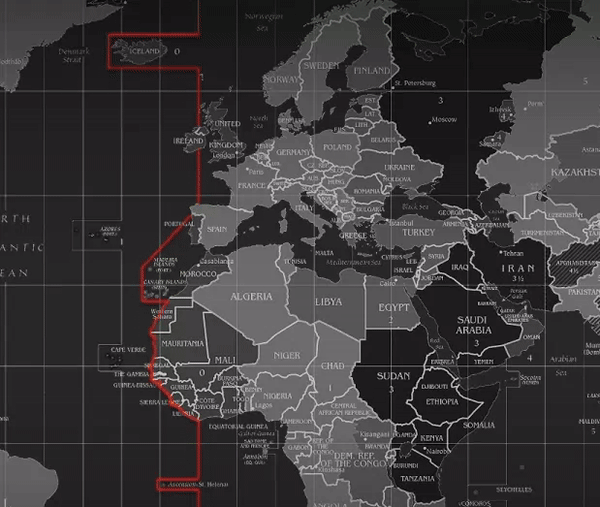

# Ulauncher - Prayer Times (Islom.uz)

         [](https://github.com/Safouene1/support-palestine-banner)

## Description

This extension allows you to obtain prayer times for your current location. 

The prayer times are based on the [Islom.uz](https://islom.uz/) website. [Islomapi.uz](https://islomapi.uz/) is used to get prayer times. 

Currently, it only serves Uzbekistan cities.

## Demo



## Requirements

- [Ulauncher](https://ulauncher.io/)
- [Python >= 3](https://www.python.org/)
- PIP Requirement:
    - [requests](https://pypi.org/project/requests/)

## Install

First install PIP and check is succesfully installed:
```
sudo apt install python3-pip && pip3 --version
```

Then install required packages via PIP:

```
pip3 install requests 
```

Open ulauncher preferences window -> extensions -> add extension and paste the following url:

```
https://github.com/mashkhurbek-mashrabov/ulauncher-islamuz-prayer
```

In extension preferences, you can change your location and language. By default location is Tashkent and language is English.

## Usage

- Open ulauncher and type `prayer` or keyword that you set.
